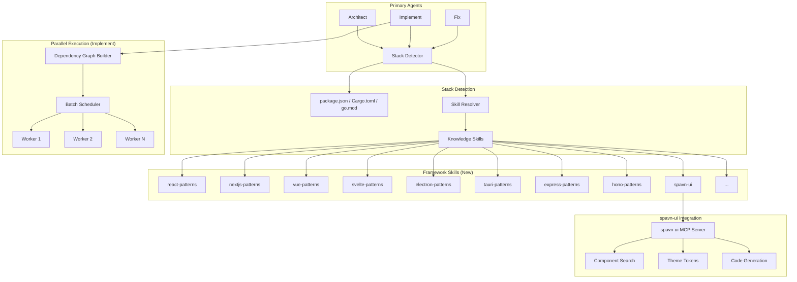
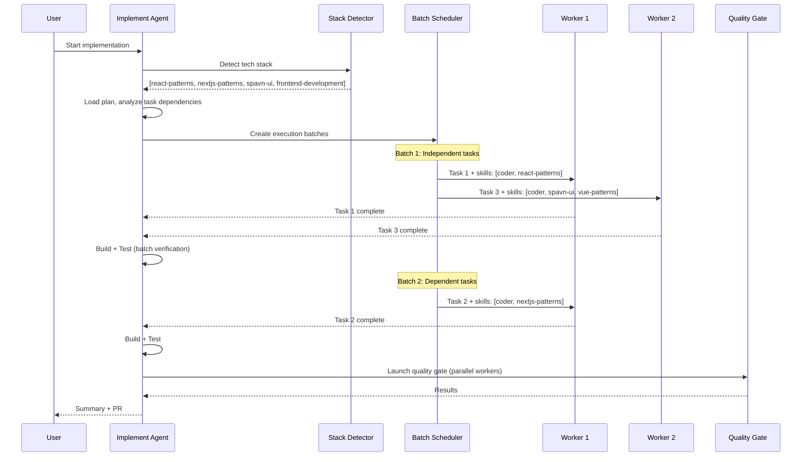

# Multi-Agent Parallelism, Framework-Specific Skills & spavn-ui Integration

# Plan: Multi-Agent Parallelism, Framework-Specific Skills & spavn-ui Integration

## Summary

This plan transforms spavn-agents from a sequential task executor into a parallel multi-agent development system with framework-aware skill resolution. The implement agent gains dependency-aware batch scheduling to run multiple workers simultaneously. Seventeen new framework-specific knowledge skills provide deep, targeted guidance for each technology. All three primary agents (architect, implement, fix) gain automatic tech stack detection that resolves and passes the right skills to workers. Finally, spavn-ui is integrated as both a knowledge skill and MCP bridge, making it the recommended UI framework for web and Electron projects.

## Architecture Diagram



## Tasks

- [ ] Task 1: Create framework-specific knowledge skills (~17 new skills)
  - AC: Each skill has SKILL.md with frontmatter, 150-300 lines of patterns/guidance
  - AC: Skills cover: react-patterns, nextjs-patterns, vue-patterns, nuxt-patterns, svelte-patterns, sveltekit-patterns, angular-patterns, electron-patterns, tauri-patterns, express-patterns, hono-patterns, fastify-patterns, nestjs-patterns, react-native-patterns, flutter-patterns, laravel-patterns, django-patterns
  - AC: Each skill includes framework-specific project structure, key patterns, anti-patterns, and technology recommendations
- [ ] Task 2: Create spavn-ui knowledge skill
  - AC: Skill teaches agents about spavn-ui's 50+ components, elevation system, design tokens
  - AC: Documents MCP server tools (search-components, get-component-api, generate-component-code, etc.)
  - AC: Includes guidance on when to recommend spavn-ui (Vue/Electron projects, or any web project wanting a polished component library)
  - AC: References `@spavn/mcp-server` for AI-assisted component work
- [ ] Task 3: Build automatic tech stack detector
  - AC: Scans package.json (dependencies/devDependencies), Cargo.toml, go.mod, requirements.txt, composer.json, pubspec.yaml
  - AC: Maps detected frameworks to specific skill names
  - AC: Returns ordered skill list (general + framework-specific)
  - AC: Detects spavn-ui presence (`@spavn/ui` in dependencies) and auto-loads spavn-ui skill
  - AC: Implemented as a reusable section in agent markdown (shared across architect, implement, fix)
- [ ] Task 4: Update implement agent — dependency-aware parallel execution
  - AC: REPL loop analyzes plan tasks for file/module dependencies
  - AC: Independent tasks launched as parallel workers (multiple Task tool calls in one message)
  - AC: Dependent tasks queued and run sequentially after their dependencies complete
  - AC: Each worker receives the resolved skill list (coder + relevant framework skills)
  - AC: Build/test verification runs after each parallel batch completes (not after each individual task)
  - AC: Max parallelism configurable (default: 3-4 concurrent workers)
- [ ] Task 5: Update implement agent — smart skill passing to workers
  - AC: Worker delegation includes `Load skills: coder, react-patterns, spavn-ui` (multiple skills per worker)
  - AC: Skill list derived from stack detector output + task-specific context
  - AC: Workers receive only skills relevant to their specific task (not all detected skills)
- [ ] Task 6: Update architect agent — auto skill loading via stack detection
  - AC: Architect runs stack detector during Step 4 (before creating plan)
  - AC: Loaded skills inform architectural recommendations
  - AC: Plan output includes detected stack and recommended skills for implementation
- [ ] Task 7: Update fix agent — auto skill loading via stack detection
  - AC: Fix runs stack detector during scope assessment
  - AC: Bug fix workers receive framework-specific skills alongside coder skill
- [ ] Task 8: Update worker agent — multi-skill loading support
  - AC: Worker can load multiple skills from prompt (e.g., "Load skills: coder, react-patterns, spavn-ui")
  - AC: Linked skills from all loaded skills are also resolved
  - AC: Access level is intersection of all loaded skill levels and mode ceiling
- [ ] Task 9: Update MCP skill tool — support multi-skill loading
  - AC: `skill` tool accepts comma-separated skill names or can be called multiple times
  - AC: Returns combined content with clear skill boundaries
- [ ] Task 10: Document spavn-ui MCP server integration
  - AC: Add configuration guidance for running spavn-ui MCP server alongside spavn-agents
  - AC: Architect agent recommends spavn-ui setup when Vue/Electron/web project detected
  - AC: spavn-ui skill references MCP tools for component discovery and code generation

## Technical Approach

### Phase 1: Framework-Specific Skills (Tasks 1-2)

Create 17 new knowledge skills under `.opencode/skills/`. Each follows the established format:

```yaml
---
name: react-patterns
description: React 19+ patterns — Server Components, Actions, hooks, state management, performance
license: Apache-2.0
compatibility: opencode
---
```

**Skill categories and contents:**

| Category | Skills | Key Content |
|----------|--------|-------------|
| Frontend | react-patterns, nextjs-patterns, vue-patterns, nuxt-patterns, svelte-patterns, sveltekit-patterns, angular-patterns | Component patterns, state management, routing, SSR/SSG, project structure |
| Desktop | electron-patterns, tauri-patterns | IPC, security, packaging, auto-update, native integration |
| Backend | express-patterns, hono-patterns, fastify-patterns, nestjs-patterns, laravel-patterns, django-patterns | Middleware, routing, ORM integration, project layout, deployment |
| Mobile | react-native-patterns, flutter-patterns | Navigation, platform-specific code, performance, app store deployment |
| UI Framework | spavn-ui | Component API, design tokens, elevation system, MCP tools |

The `spavn-ui` skill is unique — it bridges knowledge (component patterns) with tooling (MCP server reference). It should detect when the project uses `@spavn/ui` and teach agents the component API, design tokens, and elevation system.

### Phase 2: Stack Detection & Smart Skill Loading (Tasks 3, 6, 7)

Add a **Tech Stack Detection** section to all three primary agents. This replaces the current static lookup tables.

**Detection logic** (in agent markdown as behavioral instructions):

```
1. Read package.json → scan dependencies + devDependencies
2. Read Cargo.toml, go.mod, requirements.txt, composer.json, pubspec.yaml (if exists)
3. Map frameworks to skills:
   - react → react-patterns + frontend-development
   - next → nextjs-patterns + react-patterns + frontend-development
   - vue → vue-patterns + frontend-development
   - @spavn/ui → spavn-ui + vue-patterns + ui-design
   - electron → electron-patterns + desktop-development
   - express → express-patterns + backend-development
   - (etc.)
4. Load all resolved skills via `skill` tool
5. Store detected stack in plan frontmatter for downstream agents
```

This is a behavioral change in agent markdown — no engine code changes needed.

### Phase 3: Parallel Execution (Tasks 4-5)

Rework the implement agent's REPL loop from sequential to batch-parallel:

**Current flow:**
```
Task 1 → build → test → Task 2 → build → test → Task 3 → ...
```

**New flow:**
```
Analyze dependencies →
  Batch 1: [Task 1, Task 3, Task 5] (parallel) → build → test →
  Batch 2: [Task 2, Task 4] (parallel, depended on Batch 1) → build → test →
  ...
```

**Dependency analysis** (behavioral instructions for implement agent):
1. Read all plan tasks
2. For each task, identify which files/modules it touches (from task description and AC)
3. Tasks touching different files/modules are independent → same batch
4. Tasks touching same files or referencing another task's output → sequential
5. When uncertain, ask the user or default to sequential

**Worker delegation with skills:**
```
Task(subagent_type="worker", prompt="Load skills: coder, react-patterns, spavn-ui.
  Task: Implement component X.
  Files: src/components/X.vue
  AC: [criteria]
  Context: [cross-task context]")
```

### Phase 4: Worker & MCP Updates (Tasks 8-9)

Update worker agent to handle multi-skill loading:
- Parse "Load skills: X, Y, Z" from prompt
- Call `skill` tool for each
- Load linked skills from all loaded skills (deduplicated)
- Apply most restrictive access level across all skills

Update MCP `skill` tool to support loading multiple skills in one call (convenience, not required).

### Phase 5: spavn-ui Integration (Task 10)

The spavn-ui MCP server (`@spavn/mcp-server`) provides 7 tools for component work. Integration points:
- Architect recommends adding spavn-ui MCP to project config when Vue/web/Electron detected
- Implement agent's workers can call spavn-ui MCP tools for component search and code generation
- The `spavn-ui` knowledge skill teaches agents the component API, design tokens, and elevation system

## Data Flow



## Risks & Mitigations

| Risk | Impact | Likelihood | Mitigation |
|------|--------|------------|------------|
| Parallel workers create merge conflicts (editing same files) | High | Medium | Dependency analysis prevents same-file parallel edits; conservative batching when uncertain |
| Too many skills overwhelm worker context window | Medium | Medium | Pass only task-relevant skills (not all detected); keep skills focused (150-300 lines) |
| Stack detection misidentifies framework | Low | Low | Detection is additive (loads more skills, not wrong skills); user can override |
| spavn-ui MCP server not running | Low | Medium | Graceful degradation — spavn-ui skill still works without MCP; recommend setup in architect output |
| New skills become stale as frameworks evolve | Medium | High | Skills focus on stable patterns, not API details; version notes in frontmatter |

## Estimated Effort

- **Complexity**: High
- **Phases**: 5 phases, can be implemented incrementally
- **Dependencies**: Phase 1 (skills) is prerequisite for Phase 2 (detection). Phase 3 (parallel) and Phase 4 (worker updates) can run concurrently. Phase 5 (spavn-ui) depends on Phase 1.
- **Key constraint**: Skills are the foundation — everything else builds on having the right skills to load

## Key Decisions

1. **Decision**: Flat skill organization (not nested)
   **Rationale**: Simpler skill loader, easier to reference by name, matches existing pattern. Categories are implicit in naming convention (react-patterns, vue-patterns, etc.)

2. **Decision**: Stack detection as behavioral instructions in agent markdown, not engine code
   **Rationale**: No TypeScript changes needed. Agents read package.json and resolve skills themselves. Keeps the engine generic and the intelligence in the agents.

3. **Decision**: Batch-parallel execution with conservative dependency analysis
   **Rationale**: Full DAG scheduling is over-engineered for LLM-driven work. Simple file-based dependency grouping into batches is sufficient and predictable.

4. **Decision**: Workers receive task-specific skill subsets, not the full detected stack
   **Rationale**: Prevents context window bloat. A worker implementing a backend route doesn't need react-patterns.

5. **Decision**: spavn-ui as knowledge skill + MCP bridge (not a new enhanced skill)
   **Rationale**: spavn-ui provides patterns and component guidance (knowledge), not behavioral instructions (enhanced). The MCP server is a separate tool the agents can call.

## Suggested Branch Name
`feature/parallel-agents-framework-skills`
