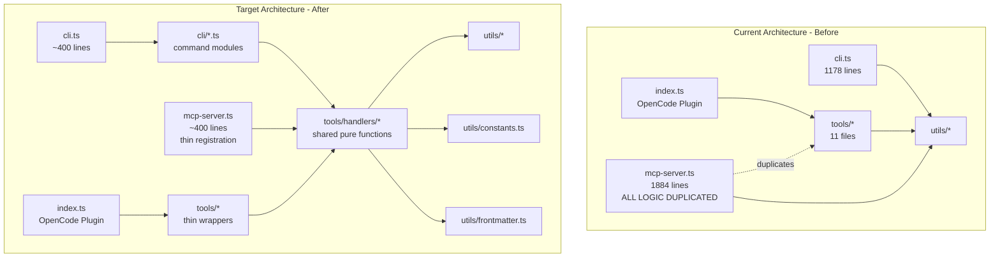

# Plan: Codebase Cleanup & MCP Server Refactor

## Summary

The spavn-agents codebase has accumulated tech debt centered around three core issues: (1) the `mcp-server.ts` god file (1,884 lines) that duplicates all 40+ tool implementations, (2) scattered constants and helper functions duplicated across 9+ files, and (3) dead code and performance-inefficient I/O patterns. This plan addresses all issues in a single coordinated refactor across 6 phases, moving from safe/non-breaking cleanup through structural decomposition to performance optimization. No behavior changes — pure refactor with all existing functionality preserved.

## Detected Stack

- **Runtime**: Node.js (ESM, `"type": "module"`)
- **Language**: TypeScript 5 (strict mode)
- **Dependencies**: `better-sqlite3`, `@modelcontextprotocol/sdk`, `zod`, `prompts`
- **Peer**: `@opencode-ai/plugin`
- **Test**: Vitest
- **Skills loaded**: `code-quality`, `architecture-patterns`

## Architecture Diagram

## Tasks

- [ ] Task 1: Remove dead code — delete unused exports and propagate.ts
  - AC: parseScopeFlag removed from cli.ts
  - AC: src/utils/propagate.ts and its test file deleted
  - AC: spawn, kill, isAlive, shellEscape removed from shell.ts (verify no external consumers first via dist/ exports)
  - AC: parseTasksFromPlan removed from repl.ts (update tests that reference it)
  - AC: ENHANCED_SKILLS removed from registry.ts
  - AC: detectPackageManager unexported (keep as private, used internally by detectCommands)
  - AC: Unused extractBranch import removed from mcp-server.ts
  - AC: All existing tests pass after removal

- [ ] Task 2: Create src/utils/constants.ts — consolidate scattered constants
  - AC: SPAVN_DIR, PLANS_DIR, SESSIONS_DIR, DOCS_DIR defined once
  - AC: PROTECTED_BRANCHES defined once (union of all current definitions)
  - AC: All 9+ files that define SPAVN_DIR import from constants.ts instead
  - AC: branch.ts, plan.ts, task.ts import PROTECTED_BRANCHES from constants.ts

- [ ] Task 3: Create src/utils/strings.ts — consolidate slugify and getDatePrefix
  - AC: Single slugify(text, maxLength = 50) function with configurable max length
  - AC: Single getDatePrefix() function
  - AC: plan.ts, docs.ts, session.ts import from strings.ts
  - AC: mcp-server.ts inline slugify replaced with import

- [ ] Task 4: Create src/utils/frontmatter.ts — unify frontmatter parsers
  - AC: Single parseFrontmatter() that handles flat key-value, arrays, and quoted values
  - AC: plan-extract.ts delegates to frontmatter.ts for parsing
  - AC: docs.ts delegates to frontmatter.ts for parsing
  - AC: Engine seed.ts parser left untouched (different domain)
  - AC: Existing frontmatter test cases still pass

- [ ] Task 5: Extract shared tool handlers into src/tools/handlers/
  - AC: Create src/tools/handlers/spavn.ts with pure functions executeInit, executeStatus, executeConfigure
  - AC: Create src/tools/handlers/worktree.ts with pure functions executeCreate, executeList, executeRemove
  - AC: Create src/tools/handlers/branch.ts with pure functions executeCreate, executeStatus, executeSwitch
  - AC: Create src/tools/handlers/plan.ts — move existing executePlanStart, executePlanInterview, executePlanApprove, executePlanEdit here; add executePlanSave, executePlanList, executePlanLoad, executePlanDelete, executePlanCommit
  - AC: Create src/tools/handlers/session.ts with pure functions executeSave, executeList, executeLoad
  - AC: Create src/tools/handlers/docs.ts with pure functions executeInit, executeSave, executeList, executeIndex
  - AC: Create src/tools/handlers/repl.ts with pure functions executeInit, executeStatus, executeReport, executeResume, executeSummary; plus unified processReplReport
  - AC: Create src/tools/handlers/github.ts with pure functions executeStatus, executeIssues, executeProjects
  - AC: Create src/tools/handlers/task.ts with pure function executeFinalize
  - AC: Create src/tools/handlers/quality-gate.ts with pure function executeQualityGateSummary
  - AC: Create src/tools/handlers/index.ts barrel export
  - AC: Each handler function takes explicit params and returns HandlerResult
  - AC: No dependency on @opencode-ai/plugin or @modelcontextprotocol/sdk in handler files

- [ ] Task 6: Rewire src/tools/*.ts (OpenCode plugin tools) to use shared handlers
  - AC: Each tool becomes a thin wrapper calling the corresponding handler
  - AC: Tool files only contain schema definition, handler call, toast notification logic
  - AC: All existing tool behavior is preserved
  - AC: All existing tests pass

- [ ] Task 7: Rewire src/mcp-server.ts to use shared handlers
  - AC: mcp-server.ts reduced from ~1884 lines to ~400 lines
  - AC: Each mcpServer.tool() registration calls the corresponding handler
  - AC: ok() and err() helper functions remain as thin wrappers
  - AC: bridgeTool() wrapper still applies around handler calls
  - AC: execute_* aliases delegate to same REPL handlers (no third copy)
  - AC: quality_gate alias delegates to same quality gate handler
  - AC: Lazy engine singleton moved to src/tools/handlers/engine-singleton.ts
  - AC: All existing MCP server tests pass

- [ ] Task 8: Performance — replace existsSync + readFileSync with try/catch pattern
  - AC: All instances of if (existsSync(x)) readFileSync(x) replaced with try/catch on readFileSync catching ENOENT
  - AC: Applied across mcp-server.ts, tools/plan.ts, tools/docs.ts, tools/session.ts, tools/coordinate.ts, utils/repl.ts
  - AC: No behavior change

- [ ] Task 9: Performance — optimize list operations to read only frontmatter
  - AC: plan_list reads only first 512 bytes of each file for frontmatter extraction
  - AC: session_list reads only first 512 bytes of each file
  - AC: docs_list reads only first 1024 bytes of each file
  - AC: rebuildIndex in docs reads only first 1024 bytes per file
  - AC: Helper function readFrontmatterOnly(filePath, maxBytes) created in utils/frontmatter.ts

- [ ] Task 10: Fix stale documentation in spavn.ts configure tool
  - AC: Tool description references current agent names architect, implement, fix (primary), worker (subagent)
  - AC: Tool output strings updated to match current architecture
  - AC: No references to crosslayer, qa, guard, ship, or audit as agent name

## Technical Approach

### Phase 1: Dead Code Removal (Task 1)

Start with the safest possible changes. Remove clearly dead exports and the unused propagate.ts module.

Key decisions:
- spawn, kill, isAlive, shellEscape in shell.ts — verify they are not part of the public API surface (they are not exported from index.ts)
- parseTasksFromPlan — wrapper around parseTasksWithAC. Tests that import it need updating
- detectPackageManager — keep the function, just remove the export keyword

### Phase 2: Constant and Helper Consolidation (Tasks 2-4)

New files created:
- src/utils/constants.ts — SPAVN_DIR, PLANS_DIR, SESSIONS_DIR, DOCS_DIR, PROTECTED_BRANCHES
- src/utils/strings.ts — slugify(), getDatePrefix()
- src/utils/frontmatter.ts — parseFrontmatter(), readFrontmatterOnly()

The unified frontmatter parser handles flat key-value, quoted values, and arrays. It does NOT handle nested YAML (engine/seed.ts is a different domain).

### Phase 3: MCP Server Decomposition (Tasks 5-7)

The approach is Extract, Delegate, Slim:

Step 1 — Extract handlers (Task 5): Create pure functions in src/tools/handlers/ with typed HandlerResult returns and no framework dependencies.

Step 2 — Rewire OpenCode tools (Task 6): Each tool becomes a thin wrapper calling handlers plus toast notifications.

Step 3 — Rewire MCP server (Task 7): mcp-server.ts becomes a thin registration layer importing from handlers.

### Phase 4: Performance Optimizations (Tasks 8-9)

Replace existsSync + readFileSync pairs with try/catch on ENOENT. Create readFrontmatterOnly() helper for list operations.

### Phase 5: Documentation Fix (Task 10)

Simple string replacements in src/tools/spavn.ts.

## Risks and Mitigations

| Risk | Impact | Likelihood | Mitigation |
|------|--------|------------|------------|
| Subtle behavior differences between MCP and OpenCode tool versions break after unification | High | Medium | Use MCP version as reference. Diff outputs line-by-line during extraction. |
| Handler extraction misses edge cases in tool argument handling | Medium | Medium | Run full test suite after each task. |
| propagate.ts removal breaks undiscovered external consumer | Low | Low | Search node_modules and dist/ for references. Not exported from index.ts. |
| Frontmatter parser unification subtly changes parsing behavior | Medium | Low | Copy all existing test cases. Add edge case tests before modifying. |
| existsSync removal changes error behavior for permission errors | Low | Low | New pattern still throws on non-ENOENT errors. |

## Estimated Effort

- Complexity: Medium-High
- Time Estimate: 6-8 hours across all 10 tasks
- Dependencies: Tasks must be done in order within each phase; phases are sequential
  - Phase 1 (Task 1): ~30 min
  - Phase 2 (Tasks 2-4): ~1.5 hrs
  - Phase 3 (Tasks 5-7): ~3-4 hrs (bulk of work)
  - Phase 4 (Tasks 8-9): ~1 hr
  - Phase 5 (Task 10): ~15 min

## Key Decisions

1. Decision: Extract handlers as pure functions rather than creating a shared class hierarchy. Rationale: Functions are simpler, easier to test, and align with the existing codebase style.

2. Decision: Keep engine/seed.ts frontmatter parser separate from unified utils/frontmatter.ts. Rationale: The seed parser handles nested YAML-like structures for a different domain.

3. Decision: Use HandlerResult { ok, text } return type rather than throwing errors. Rationale: Consistent with existing tool pattern where prefixes indicate success/failure.

4. Decision: Keep bridgeTool() wrapper in mcp-server.ts rather than moving to handlers. Rationale: The bridge is MCP-server-specific. Handlers should be framework-agnostic.

5. Decision: Aggressive dead code removal for shell utilities (spawn, kill, isAlive, shellEscape). Rationale: Not exported from public API. YAGNI.

6. Decision: Only remove clearly dead code; keep vestigial engine facade methods. Rationale: User preference. Methods are public API surface.
