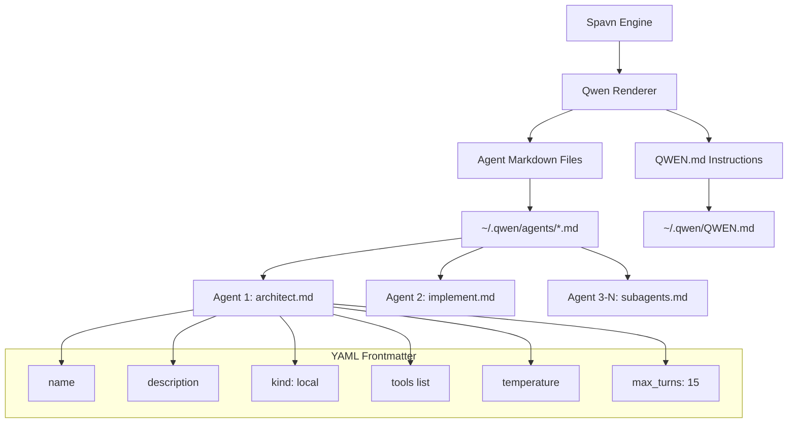

# Feature: Qwen CLI Target Support

## Overview

Spavn Agents now supports **Qwen CLI** as a first-class target platform, alongside OpenCode, Claude Code, Codex CLI, and Gemini CLI. This integration allows Qwen CLI users to leverage Spavn's structured development workflows, specialized agents, and quality gate system.

The Qwen CLI target renders Spavn's 12 agents and 17 skills into Qwen's native format: per-agent markdown files with YAML frontmatter stored in `~/.qwen/agents/`, plus a `QWEN.md` instructions file.

## Architecture



## Key Components

| Component | File | Purpose |
|-----------|------|---------|
| Qwen Renderer | `src/engine/renderers/qwen.ts` | Transforms DB records to Qwen format |
| Target Config | `src/engine/seed.ts` | Defines `~/.qwen` as config directory |
| Tool Mapping | `src/engine/renderers/qwen.ts` | Maps OpenCode tools to Qwen CLI equivalents |
| Model Registry | `src/registry.ts` | Lists Qwen3-Coder-Plus and Qwen3.5-Plus models |

## Tool Mapping

Spavn's tools are mapped to Qwen CLI's native tool names:

| Spavn Tool | Qwen CLI Tool |
|------------|---------------|
| `read` | `read_file` |
| `write` | `write_file` |
| `edit` | `edit_file` |
| `bash` | `run_shell_command` |
| `glob` | `glob_tool` |
| `grep` | `grep_search` |
| Other tools | `mcp_spavn-agents_{toolname}` |

## Usage

```bash
# Install Spavn Agents for Qwen CLI
npx spavn-agents install --target qwen

# Re-sync after database updates
npx spavn-agents sync --target qwen

# Start MCP server for Qwen CLI
npx spavn-agents mcp
```

## Configuration

After installation, Qwen CLI configuration is located at:

```
~/.qwen/
├── agents/
│   ├── architect.md      # Primary agent
│   ├── implement.md      # Primary agent
│   ├── fix.md            # Primary agent
│   ├── testing.md        # Subagent
│   ├── security.md       # Subagent
│   ├── audit.md          # Subagent
│   ├── docs-writer.md    # Subagent
│   ├── perf.md           # Subagent
│   ├── devops.md         # Subagent
│   ├── coder.md          # Subagent
│   ├── refactor.md       # Subagent
│   └── debug.md          # Subagent
└── QWEN.md               # Global instructions
```

## Agent File Format

Each agent is rendered as a markdown file with YAML frontmatter:

```yaml
---
name: architect
description: Read-only analysis and planning agent
kind: local
tools:
  - read_file
  - grep_search
  - mcp_spavn-agents_plan_save
  - mcp_spavn-agents_plan_list
temperature: 0.2
max_turns: 15
---

[Agent system prompt content...]
```

## Supported Models

The following Qwen models are available in the model picker:

| Model | Tier | Description |
|-------|------|-------------|
| `qwen/qwen3-coder-plus` | Premium | State-of-the-art code model optimized for software development |
| `qwen/qwen3.5-plus` | Premium | Latest Qwen model with advanced reasoning capabilities |

## Integration Requirements

- **Qwen CLI**: Available at [github.com/QwenLM/qwen-code](https://github.com/QwenLM/qwen-code)
- **Node.js**: >= 18.0.0
- **MCP Server**: Spavn's MCP server exposes all tools via stdio for Qwen CLI

## Limitations

- Qwen CLI uses the same tool naming convention as Gemini CLI (snake_case with `_tool` suffix)
- MCP tools are prefixed with `mcp_spavn-agents_` to avoid conflicts
- Agent files use `kind: local` (Qwen CLI's local agent format)
- Maximum conversation turns limited to 15 per agent (configurable in frontmatter)
